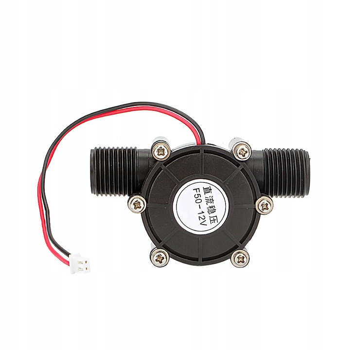
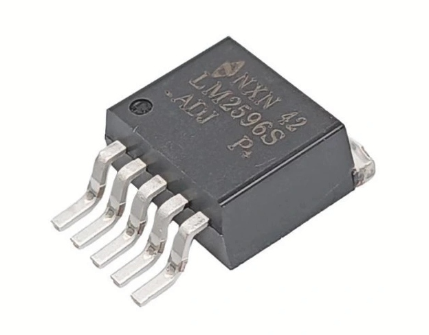
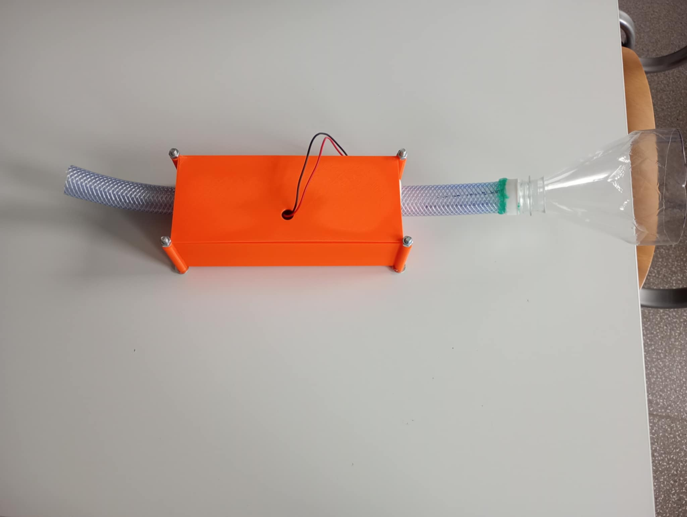
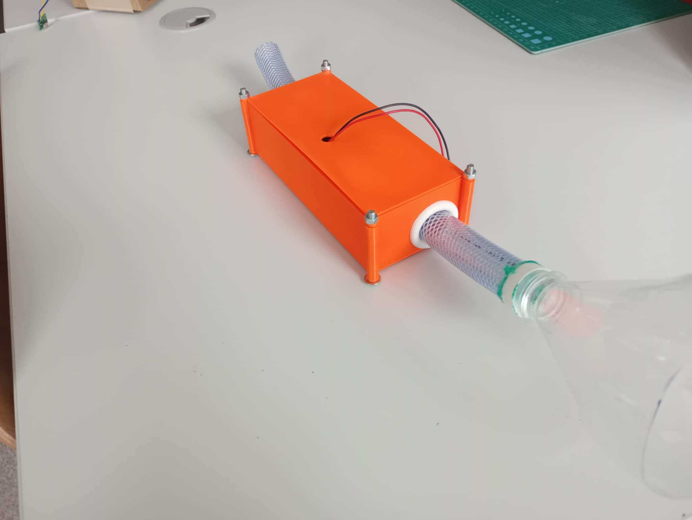
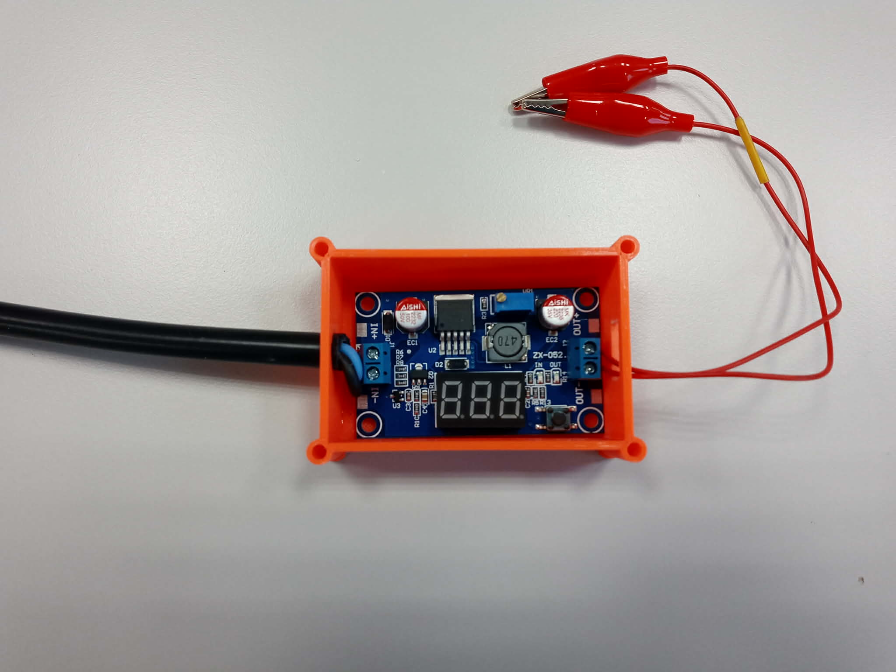
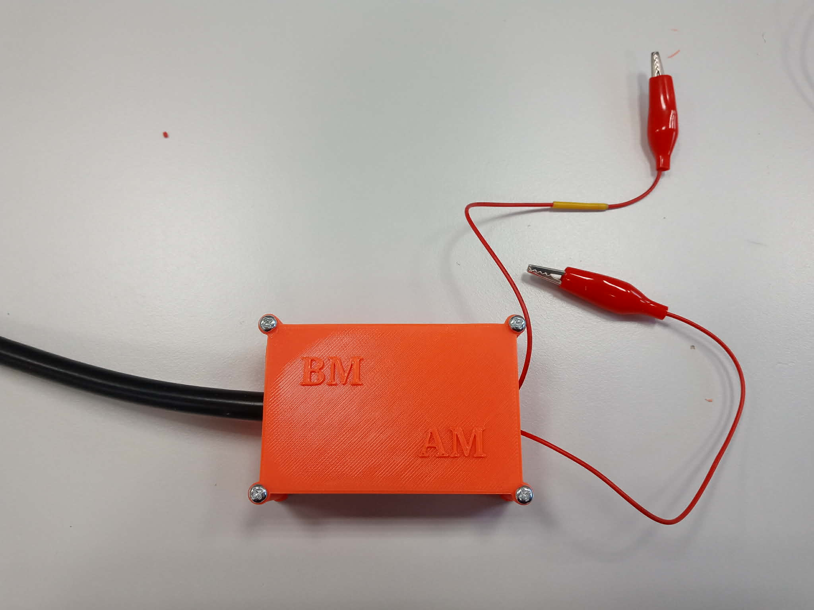

# Wodna Ładowarka/Water Charger
# Authors 
-  Atena Mynarska
-  Bartosz Marszałek
# Description of the project 
 The Water Charger is a miniature water turbine designed to charge smartphone batteries. It's meant to be used in off-grid places to charge one's personal devices, while being lighter than a power bank. The version presented here is a prototype with much room for improvement.
# Science and tech used 
The project consist of the following elements:
## Water turbine 

||
| --- |
|  |

A small water turbine, capable of generating a max 12 V, 100 mA output under 1.2 MPa of pressure. [1]
## Regulator
| |
| --- |
|  |

A voltage regulator, lowering the voltage to a stable 5 V [2]

## USB outlets
Standard USB-A and USB-C outlets, for plugging in smartphones and other devices.
# State of the art 
The water charger consists of 2 containers connected to each other by waterproof wire. One box contains the turbine and pipes while the other one contains the regulator. The turbine should be placed underwater, and the second box should be kept dry. Cables running out of the dry box are test wires to measure the output voltage and/or current.
| Wet box --  overhead and sideways view|
| --- |
|  |
| |

| Dry box --  open and closed|
| --- |
|  |
| |

The two boxes were 3D printed using the Prusa printer available in the Garage. The STL files used are attached in the project. The two USB outlets are currently disconnected from the circuit as the current isn't sufficient to charge a smartphone or similar device. 
# What next?
The max output current is 100 mA, which is insufficient to charge a smartphone.The plan is currently to expand the project by connecting at least five turbines as parallel circuits. Every turbine should be equipped with its own voltage stabiliser to avoid reverse current. Another solution would be to build a custom water turbine capable of producing a larger current; possibly with custom 3D printed elements. The wet box should be sealed to make it more waterproof; while the dry box should be expanded to fit the USB outlets. 
# Sources 
[1]
[2]
[3]
